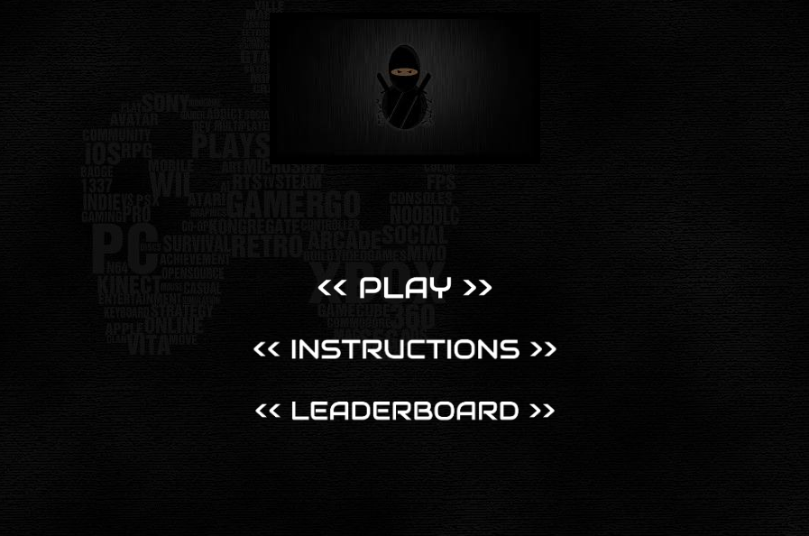
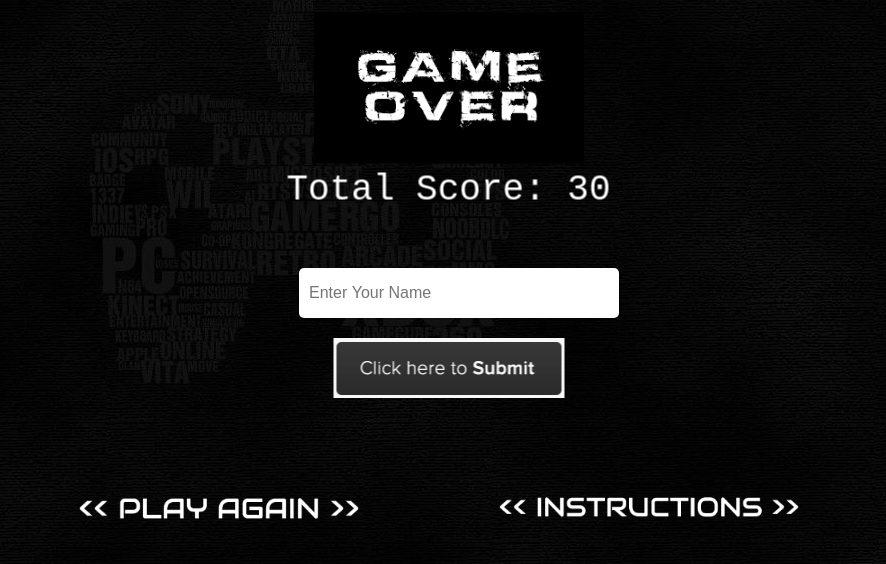

# Endless Runner Game Javascript

This is a Platform game where users can play from their browsers and submit their name and score so as to track the best player ever.

# Built with

- Phaser
- Javascript
- Jest
- Webpack

# Game Description

- To play this game, the player has to jump on the different platforms as they run towards the right of the screen. Ensure that you jump on the platform. A player collects points as he collects the stars falling from the upper section of the screen. Each star is 10 points, so ensure to collect as much as you can to be the best of the best.

- The character items were taken from [Open Game Art](https://opengameart.org/)

- The images were taken from [Wallpaper Cave](https://wallpapercave.com/dark-gaming-wallpapers)

# Live Version 
- [Live Link](https://stormy-thicket-31990.herokuapp.com/)

# Game Instructions
- Use the up arrow key to jump over the infinite platforms.
- Use the left and right arrow keys to move and redirect your jump.
- Ensure there is contact with the stars so as to collect points.
- The only way to survive is to mantain yourself above the platforms.

# Project Setup
- Fork this GitHub repository
- Clone the repository to your machine
- Run `npm install` to install the project dependencies
- Run `node server.js ` to load the application on your browser
- Open `http://localhost:3000/` on your browser

# Game Images

# Testing 
- Run ` npm run test` to check the methods tests

# Project Design

## Project purpose

Development of a platform game as part of the Microverse curriculum to show technical and soft skills learned through the curriculum. Use of Phaser 3 to develop the game.

## Objectives

- Design the game, selecting a main theme for the game and characters.
- Research for assets and media content: sprite sheets and images.
- Write code for the game: Scenes, Characters.
- Add a score system
- Include a backend API to store a leader board.
- Add enemies and game sound.
- Add unit test using Jest.

## Achievements

- Choose a ninja as main character. Select a infinite platform game.
- Use wall paper cave images as back game background.
- Use Open Game Art for platform image and ninja sprite sheet, then use Figma website to create the sprite sheets for ninja actions.
- Write code for different scenes: Load Scene, Instructions, Main Menu, Main Scene and GameOver Scene.
- Add ninja-star as collectible items for the score system.
- Send request to get the API key and code LeaderBoard Scene
- Use axios and jest mocks to add tests.

## Author

👤 **Odong Sunday**

- [Portfolio](https://odongsunday.netlify.app/)
- Github: [@OdongAlican](https://github.com/OdongAlican)
- Twitter: [@odongsandie](https://twitter.com/odongsandie)
- Linkedin: [Sunday Alican odong](https://www.linkedin.com/in/sunday-alican-odong/)
- [Email](mailto:sandieo.2020@gmail.com)

## 🤝 Contributing

Contributions, issues and feature requests are welcome!

Feel free to check the [issues page](https://github.com/OdongAlican/phaser-gmae/issues).

## Show your support

Give a ⭐️ if you like this project!